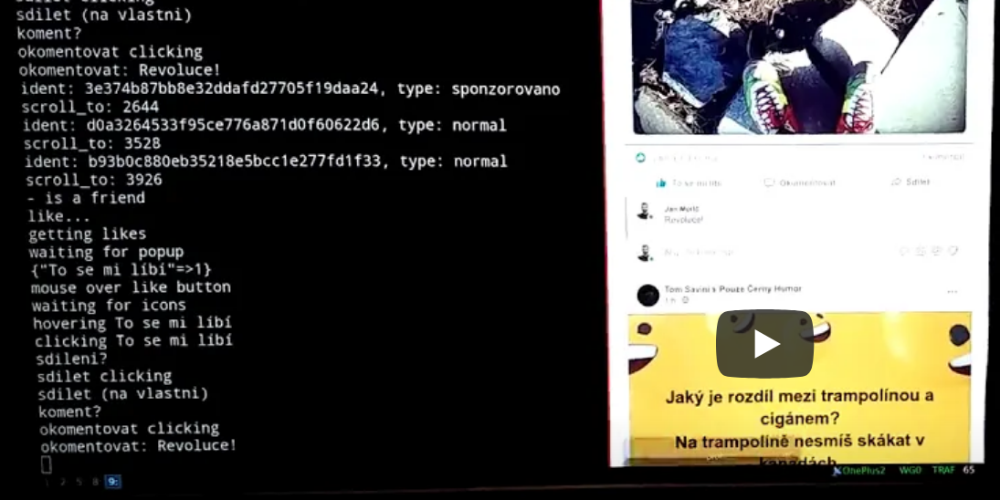

# facebook-rockin-best-automation-selenium-scrape-no-api-tool-bot-machine-made-to-destroy-facebook

Or simply "fb.rb" is an automation tool for webscraping the facebook.com.


## Features:

  - everything is scraped using Selenium, no API is used
  - visible/headless mode
  - login
  - get/cache friends
  - traverse timeline
  - give a like (also different types)
  - get number of likes
  - detect if a like has already been given
  - get number of shares
  - share a post on my timeline
  - get number of comments
  - comment a post
  - delete a post (suicide mode)

planned:

  - post something


## See it in action (video)

[](https://www.youtube.com/watch?v=hf0iS7koCPo "In Action!")


## Prerequisities

The library `lib/fb.rb` works with chromium/chrome only at the moment. Selenium supports Firefox as well, if you like, you can commit an improvement.

Browser's window is expected to be 1000 pixels width and at least 1000 pixels height, zoomed 100%. In different sizes, the page looks differently and therefore the bot may not work.

Because the bot is searching for texts, language is important. English (US) and Czech are supported. 


## Installation step by step

1. install ruby

It may be already installed, just type "ruby -v" to check the version.

2. install chromium/chrome

3. install selenium

4. install selenium-webdriver gem (a ruby library)

```bash
$ gem install selenium-webdriver

```

5. clone this repo and chdir into it

```bash
$  git clone https://github.com/mig1984/facebook-rockin-best-automation-selenium-scrape-no-api-tool-bot-machine-made-to-destroy-facebook.git
$  cd facebook-rockin-best-automation-selenium-scrape-no-api-tool-bot-machine-made-to-destroy-facebook
```

## Howto

1. Edit `settings.rb`.

1. The `bot.rb` is the robot (autolike/autocomment/autoshare). It itself is just a working example - you may wish to change it completely.

   There are other programs which use the same `settings.rb` and `lib/fb.rb`. For instance `suicide.rb`, a tool for removing
   all of your posts. But we will be using `debug.rb` now.

3. Run the `debug.rb`:

```bash
$ ruby debug.rb
D, [2021-02-27T14:57:52.857216 #28190] DEBUG -- : starting chrome
D, [2021-02-27T14:57:53.642585 #28190] DEBUG -- : chromium started
```

4. A browser window should appear and an irb console, too. Log into the facebook manually and set the browser to start in the last closed state (next time the bot won't need to log-in. There is also a 'login' method, but I don't use it since I do it like this).

5. Remember that the window size is important, especially it's width. Make it 1000x1000 and set zoom to 100%.

6. Now try to load friends. On the irb console type:

```irb
irb(#<FB:0x0000563e6d41d578>):001:0> friends
I, [2021-02-27T14:59:33.522214 #28190]  INFO -- : loading friends...
D, [2021-02-27T14:59:35.098771 #28190] DEBUG -- : loading anchors...
D, [2021-02-27T14:59:35.810020 #28190] DEBUG -- : scroll_to_bottom
D, [2021-02-27T14:59:35.832218 #28190] DEBUG -- : scroll_to: 2228
D, [2021-02-27T14:59:37.861725 #28190] DEBUG -- : loading anchors...
D, [2021-02-27T14:59:39.154125 #28190] DEBUG -- : scroll_to_bottom
D, [2021-02-27T14:59:39.157675 #28190] DEBUG -- : scroll_to: 4212
D, [2021-02-27T14:59:41.165744 #28190] DEBUG -- : loading anchors...
D, [2021-02-27T14:59:43.364750 #28190] DEBUG -- : scroll_to_bottom
D, [2021-02-27T14:59:43.367785 #28190] DEBUG -- : scroll_to: 6192
D, [2021-02-27T14:59:45.377527 #28190] DEBUG -- : loading anchors...
=> ["aaaa", "bbbbb", "ccccc", "dddd", ....... ]
```

If this works, everything else will probably work.

A file firends.yaml should appear in the current directory. It is a cache. Delete the file to force an update next time.

7. Try to get 2 posts.

```irb
irb(#<FB:0x0000563e6d41d578>):002:0> posts = timeline(2)
D, [2021-02-27T15:01:33.220230 #28190] DEBUG -- : loading homepage
I, [2021-02-27T15:01:35.162439 #28190]  INFO -- : traversing the timeline...
I, [2021-02-27T15:01:35.972156 #28190]  INFO -- : feed unit: ident=9439123d2ff06357ac7aa7654d77b4ac, type=normal
D, [2021-02-27T15:01:36.003776 #28190] DEBUG -- : scroll_to: 511
I, [2021-02-27T15:01:40.711514 #28190]  INFO -- : feed unit: ident=66d9a73154e00bd28adee7ce274339c2, type=sponsored
D, [2021-02-27T15:01:40.716863 #28190] DEBUG -- : scroll_to: 1495
=> [#<struct FB::FeedUnit el=#<Selenium::WebDriver::Element:0x72d240308599784e id="adc8a930-ddf7-4cfc-a72f-b07b891a56cb">, type=:normal, ident="9439123d2ff06357ac7aa7654d77b4ac", header="Michal SperlingMichal Sperling">, #<struct FB::FeedUnit el=#<Selenium::WebDriver::Element:0x609931b4682c7d8a id="d4d29503-9605-4387-b12f-160a72fdb492">, type=:sponsored, ident="66d9a73154e00bd28adee7ce274339c2", header="Alza.cz Alza.cz Sponsored\n  ·Sponsored\n  ·">]
```

(type `posts.inpsect` to see the content of the array).

8. Like the first post.

```irb
irb(#<FB:0x0000563e6d41d578>):005:0> like posts.first
I, [2021-02-27T15:04:35.952951 #28190]  INFO -- : like...
D, [2021-02-27T15:04:35.953062 #28190] DEBUG -- : getting likes...
D, [2021-02-27T15:04:36.285573 #28190] DEBUG -- : - waiting for a popup
D, [2021-02-27T15:04:38.657369 #28190] DEBUG -- : {"Like"=>1}
D, [2021-02-27T15:04:38.670173 #28190] DEBUG -- : - hovering the button
D, [2021-02-27T15:04:38.963086 #28190] DEBUG -- : - waiting for icons
D, [2021-02-27T15:04:41.487540 #28190] DEBUG -- : - hovering Like
D, [2021-02-27T15:04:42.802933 #28190] DEBUG -- : - clicking Like
=> true
```

9. Write a comment.

```irb
irb(#<FB:0x0000563e6d41d578>):006:0> comment posts.first, "I love this!"
I, [2021-02-27T15:09:18.443871 #28190]  INFO -- : comments...
D, [2021-02-27T15:09:19.241379 #28190] DEBUG -- : - entering text: I love this!
=> nil
```

10. Share the post.

```irb
irb(#<FB:0x0000563e6d41d578>):006:0> share posts.first
I, [2021-02-27T15:11:12.078970 #28190]  INFO -- : sharing...
D, [2021-02-27T15:11:12.249579 #28190] DEBUG -- : - on my own timeline
=> nil
```

11. Get number of shares of the post.

```irb
irb(#<FB:0x0000563e6d41d578>):006:0> shares posts.first
=> 5
```

12. Finally type CTRL-D (or CTRL-C) to exit the irb console and start the automatic process in the shell:

```bash
$ ruby bot.rb
```

or headless

```bash
$ HEADLESS=1 ruby bot.rb
```


## Debugging and adding features

1. Start the debug.rb with the environment variable DEVELOPMENT set. In the shell, type:

```bash
$ DEVELOPMENT=1 ruby debug.rb
```

It is not necessary, but it will start inherited console on error instead of continuing.

2. A console and a browser window should appear.

3. Look into the FB class (`lib/fb.rb`) and the `comment` method. There is a line

```ruby
button = elmw ".//div[@aria-label='#{COMMENTS_BUTTON_LABEL}']", fu.el
```

Mabye there is a problem. So try to debug the line on the console.

```irb
irb(#<FB:0x0000563e6d41d578>):014: posts = timeline(2)  # get up to two posts
irb(#<FB:0x0000563e6d41d578>):015: fu = posts.first     # fu means feed unit
irb(#<FB:0x0000563e6d41d578>):016: button = elmw ".//div[@aria-label='#{COMMENTS_BUTTON_LABEL}']", fu.el   # fu.el is the selenium's element
```

4. If you want to modify the FB instance on-the-fly, ruby allows this. Just re-define a method:

```irb
irb(#<FB:0x0000563e6d41d578>):017:2*   def comment
irb(#<FB:0x0000563e6d41d578>):018:2*     'new contents'
irb(#<FB:0x0000563e6d41d578>):019:1*   end
=> :comment
```

Adding new methods works the same way.

When you are done, don't forget to modify the file :-)


Enjoy!
